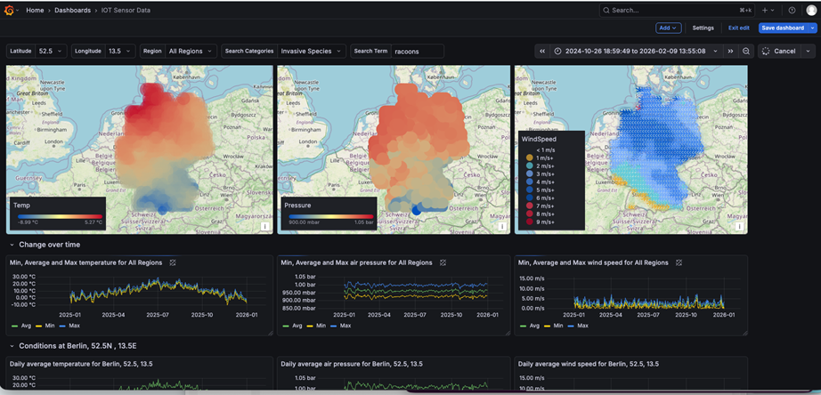
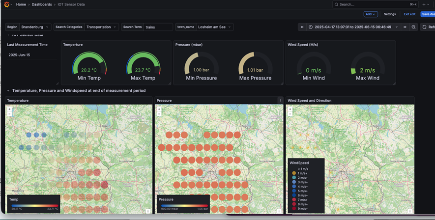

# CrateDB Explore

This project accompanies the [CrateDB Explore: IoT Analytics](https://cratedb.com/explore/iot-analytics?use-case=iot) hands-on demo. That demo walks you through real-time IoT analytics using weather monitoring data — 260k timestamped readings from 80 weather stations across Germany with temperature, humidity, and pressure values. You run hourly aggregations in under a second, execute geographic SQL queries, and connect a live Grafana dashboard, all in about 30 minutes.

The load generators in this repository let you drive that same dataset with a configurable mix of geo-proximity, multi-table join, and full-text search queries over the PostgreSQL wire protocol. Each implementation produces identical workloads and reports latency percentiles via [HdrHistogram](https://github.com/HdrHistogram/HdrHistogram).

## Weather Load Generators

| Language | Directory | Driver |
| -------- | --------- | ------ |
| [Java](src_weather/main/java/README.md) | `src_weather/main/java/` | JDBC (`postgresql`) |
| [Python](src_weather/main/python/README.md) | `src_weather/main/python/` | [psycopg2](https://www.psycopg.org/) |
| [.NET (C#)](src_weather/main/dotnet/README.md) | `src_weather/main/dotnet/` | [Npgsql](https://www.npgsql.org/) |

## KNN Search CLI

Interactive search tool for CrateDB's `german_regions` table. Supports semantic search via OpenAI embeddings + `KNN_MATCH`, and BM25 fulltext search via `MATCH` — no OpenAI key needed for fulltext mode.

| Language | Directory | Driver |
| -------- | --------- | ------ |
| [Java](src_knn_search/main/java/README.md) | `src_knn_search/main/java/` | JDBC (`postgresql`) + [Gson](https://github.com/google/gson) |
| [Python](src_knn_search/main/python/README.md) | `src_knn_search/main/python/` | [psycopg](https://www.psycopg.org/) + [OpenAI](https://github.com/openai/openai-python) |
| [.NET (C#)](src_knn_search/main/dotnet/README.md) | `src_knn_search/main/dotnet/` | [Npgsql](https://www.npgsql.org/) |

## Data and Schema

The `sql/` directory contains the DDL and DML needed to set up the demo tables:

| File | Description |
| ---- | ----------- |
| [`german_weather_data_ddl.sql`](sql/german_weather_data_ddl.sql) | `CREATE TABLE` statements for `climate_data`, `german_regions`, and `geo_points` |
| [`german_weather_data_dml.sql`](sql/german_weather_data_dml.sql) | `COPY FROM` and `INSERT` statements to load reference data |

The `data/` directory contains the reference datasets:

| File | Description |
| ---- | ----------- |
| [`geo_points.json`](data/geo_points.json) | 726 weather station locations with nearest-town mappings |
| [`german_regions.json`](data/german_regions.json) | 16 German states with boundaries, fulltext columns, and embeddings |
| [`export-demo_climate_data_large_v2.json`](data/export-demo_climate_data_large_v2.json) | Climate measurement readings |

## MCP Search (Claude + CrateDB)

A Python CLI that lets [Claude](https://www.anthropic.com/claude) answer questions about the weather dataset by calling MCP tools. Each panel in the Grafana dashboard is registered as an in-process MCP tool alongside the official `cratedb-mcp` server, so Claude can run the dashboard's own SQL or fall back to arbitrary queries.

| Language | Directory | Driver |
| -------- | --------- | ------ |
| [Java](src_mcp_search/main/java/README.md) | `src_mcp_search/main/java/` | [Anthropic Java SDK](https://github.com/anthropics/anthropic-sdk-java) + HTTP `_sql` |
| [Python](src_mcp_search/main/python/README.md) | `src_mcp_search/main/python/` | [claude-agent-sdk](https://github.com/anthropics/claude-agent-sdk-python) + [cratedb-mcp](https://github.com/crate/cratedb-mcp) |

## Grafana Dashboard

The `grafana/` directory contains a pre-built dashboard for visualizing the weather data:

| File | Description |
| ---- | ----------- |
| [`german_weather_data.json`](grafana/german_weather_data.json) | Importable Grafana dashboard with geomap, gauge, and time-series panels. Connects to CrateDB via the PostgreSQL datasource plugin. |

To use it, add a PostgreSQL datasource in Grafana pointing at your CrateDB cluster, then import the JSON file via **Dashboards > Import**.

## Prerequisites

- Network access to your CrateDB cluster on port 5432
- The tables above populated in a `demo` schema (run the DDL then DML scripts)

See each implementation's README for language-specific setup and usage instructions.

## License

Apache License 2.0. See the [LICENSE](LICENSE) file.
