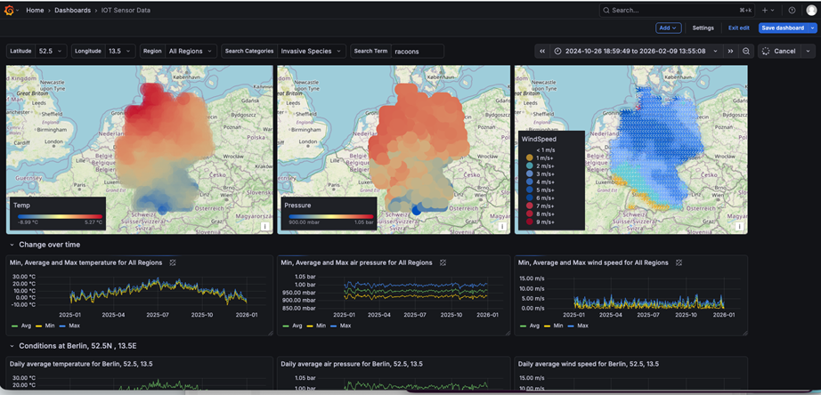
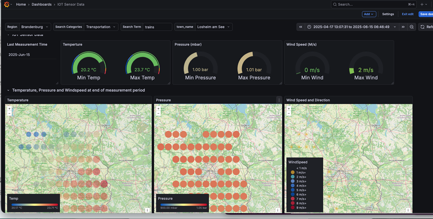
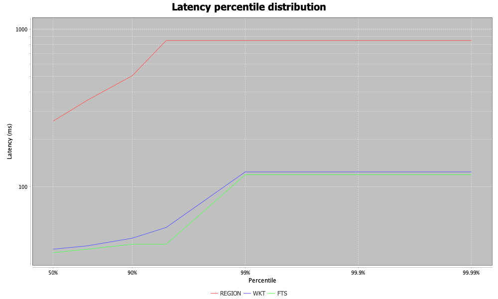
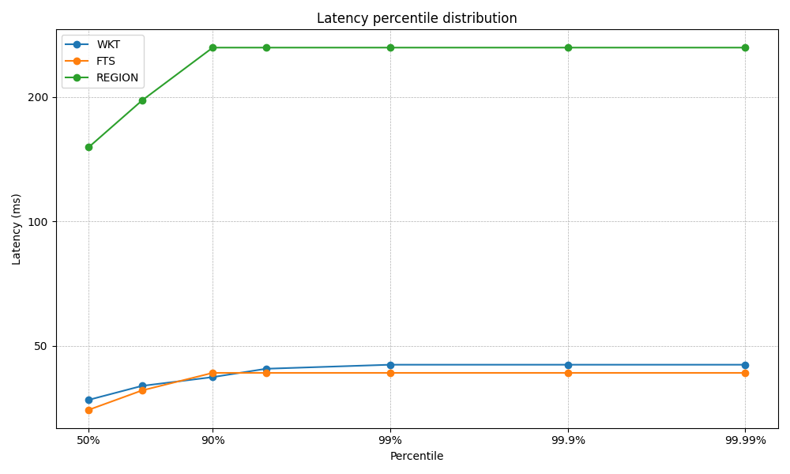
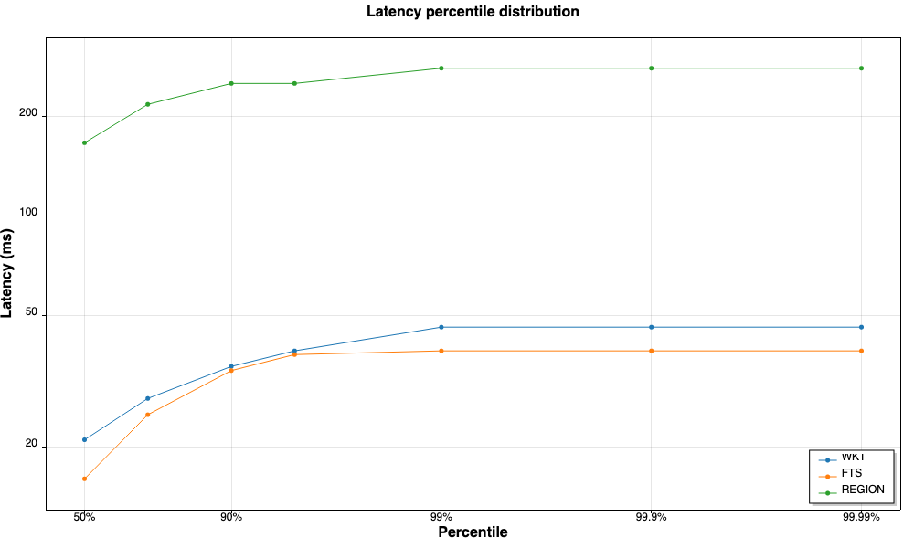

# CrateDB Explore




This project accompanies the [CrateDB Explore: IoT Analytics](https://cratedb.com/explore/iot-analytics?use-case=iot) hands-on demo. That demo walks you through real-time IoT analytics using weather monitoring data — 260k timestamped readings from 80 weather stations across Germany with temperature, humidity, and pressure values. You run hourly aggregations in under a second, execute geographic SQL queries, and connect a live Grafana dashboard, all in about 30 minutes.

The load generators in this repository let you drive that same dataset with a configurable mix of geo-proximity, multi-table join, and full-text search queries over the PostgreSQL wire protocol. Each implementation produces identical workloads and reports latency percentiles via [HdrHistogram](https://github.com/HdrHistogram/HdrHistogram).

The repository also contains a second, self-contained scenario — **[Real Time Industrial Analytics (RTIA)](#real-time-industrial-analytics-rtia)** — a SQL-and-dashboard walkthrough over a fictional fleet of German factories (plants, devices, maintenance logs, and live sensor readings in the `rtia` schema). It reuses the same CrateDB techniques — geo containment, full-text `MATCH`, and vector `KNN_MATCH` — against industrial data instead of weather. Everything from here down to the Grafana dashboard covers the **weather** demo; RTIA has its own section near the end.

## Weather Load Generators

| Language | Directory | Driver |
| -------- | --------- | ------ |
| [Java](src_weather/main/java/README.md) | `src_weather/main/java/` | JDBC (`postgresql`) |
| [Python](src_weather/main/python/README.md) | `src_weather/main/python/` | [psycopg2](https://www.psycopg.org/) |
| [.NET (C#)](src_weather/main/dotnet/README.md) | `src_weather/main/dotnet/` | [Npgsql](https://www.npgsql.org/) |

### Query types

All three implementations expose the same three query types, mixed via `TYPE:COUNT` arguments at the command line. Each stresses a different side of CrateDB:

- **`WKT`** — geo-proximity scan. Picks a random `geo_point` + `timestamp` from a pre-loaded pool and asks for the min/max temperature within 1° of that point at that moment. Exercises spatial filtering on `geo_point`. One row out per call. Cheapest of the three; sits at the bottom of the latency chart.
- **`REGION`** — three-table join. Picks a random federal-state name and returns every sensor inside that polygon at the most recent measurement epoch, with its nearest-town label. Exercises `WITHIN(point, polygon)` containment, a correlated `max(measurement_time)` subquery, and a join on `geo_location`. Almost always the slowest — polygon containment is O(vertices) per candidate point, the subquery scans all of `climate_data`, and the result set is dozens of rows.
- **`FTS`** — full-text relevance ranking. Picks a random term (`cars`, `trains`, `factories`, `energy`) and runs `MATCH(economics, ?)` against `german_regions`, returning the top 3 by `_score`. Exercises the Lucene-backed full-text index. Three rows out. Fast in steady state, occasional tail spikes on cold matches.

See each implementation's `Query types` section ([Java](src_weather/main/java/README.md#query-types) / [Python](src_weather/main/python/README.md#query-types) / [.NET](src_weather/main/dotnet/README.md#query-types)) for the SQL and language-specific notes.

### Latency charts

After each run, every implementation writes a `latency_histogram.png` to its working directory — a percentile-distribution plot (50%, 90%, 99%, 99.9%, 99.99%) with one line per query type, rendered with the platform's native plotting library. The shape is the same in all three (REGION climbs into a tail plateau, WKT/FTS stay low); only the styling differs.

| Java &mdash; [JFreeChart](https://www.jfree.org/jfreechart/) | Python &mdash; [matplotlib](https://matplotlib.org/) | .NET &mdash; [ScottPlot](https://scottplot.net/) |
| --- | --- | --- |
| [](src_weather/main/java/README.md#latency-chart) | [](src_weather/main/python/README.md#latency-chart) | [](src_weather/main/dotnet/README.md#latency-chart) |

## KNN Search CLI

Interactive search tool for CrateDB's `german_regions` table. Supports semantic search via OpenAI embeddings + `KNN_MATCH`, and BM25 fulltext search via `MATCH` — no OpenAI key needed for fulltext mode.

| Language | Directory | Driver |
| -------- | --------- | ------ |
| [Java](src_knn_search/main/java/README.md) | `src_knn_search/main/java/` | JDBC (`postgresql`) + [Gson](https://github.com/google/gson) |
| [Python](src_knn_search/main/python/README.md) | `src_knn_search/main/python/` | [psycopg](https://www.psycopg.org/) + [OpenAI](https://github.com/openai/openai-python) |
| [.NET (C#)](src_knn_search/main/dotnet/README.md) | `src_knn_search/main/dotnet/` | [Npgsql](https://www.npgsql.org/) |

## Data and Schema

The `sql/` directory contains the DDL and DML needed to set up the demo tables:

| File | Description |
| ---- | ----------- |
| [`german_weather_data_ddl.sql`](sql/german_weather_data_ddl.sql) | `CREATE TABLE` statements for `climate_data`, `german_regions`, and `geo_points` |
| [`german_weather_data_dml.sql`](sql/german_weather_data_dml.sql) | `COPY FROM` and `INSERT` statements to load reference data |

The `data/` directory contains the reference datasets:

| File | Description |
| ---- | ----------- |
| [`geo_points.json`](data/geo_points.json) | 726 weather station locations with nearest-town mappings |
| [`german_regions.json`](data/german_regions.json) | 16 German states with boundaries, fulltext columns, and embeddings |
| [`export-demo_climate_data_large_v2.json`](data/export-demo_climate_data_large_v2.json) | Climate measurement readings |

### Loading the data with `COPY FROM`

The same three datasets are published as newline-delimited JSON in a public S3
bucket, so the quickest way to populate the demo tables is to let CrateDB pull
them in directly. Run the DDL first so the tables exist, then:

```sql
COPY demo.geo_points
  FROM 'https://guided-path.s3.us-east-1.amazonaws.com/geo_points.json'
  WITH (format = 'json') RETURN SUMMARY;

COPY demo.german_regions
  FROM 'https://guided-path.s3.us-east-1.amazonaws.com/german_regions.json'
  WITH (format = 'json') RETURN SUMMARY;

COPY demo.climate_data
  FROM 'https://guided-path.s3.us-east-1.amazonaws.com/export-demo_climate_data_large_v2.json'
  WITH (format = 'json') RETURN SUMMARY;
```

Notes:

- **It runs on the cluster, not your client.** CrateDB fetches each URL
  server-side, so the *cluster nodes* need outbound network access to S3. The
  bucket is public, so no credentials are required.
- **Keys in each JSON object map to table columns.** These files line up with
  the DDL directly: `geo_location` (`[lon, lat]`) → `GEO_POINT`, `geo_coords`
  (GeoJSON) → `GEO_SHAPE`, `embedding` (1536-element array) → `FLOAT_VECTOR`,
  and the ISO-8601 `measurement_time` string → `TIMESTAMP`.
- **`RETURN SUMMARY`** reports per-node success/error counts so you can confirm
  all rows landed (726 geo points, 16 regions, and the full climate stream).
- **Reloads are idempotent, not additive.** All three tables have primary keys
  (`geo_points` on `(latitude, longitude)`, `german_regions` on `region_name`,
  and `climate_data` on `(measurement_time, latitude, longitude)` via generated
  columns — `geo_point` itself can't be a key). `COPY FROM` does not upsert, so
  re-running it on an already-loaded table reports every existing row as a
  duplicate-key conflict in `RETURN SUMMARY` (the `error_count`) and keeps the
  current row — it won't silently double the data. To refresh a table from
  scratch, `DELETE`/`DROP` it first; to merge updates, use
  `INSERT … ON CONFLICT DO UPDATE` instead of `COPY FROM`.
- Run `REFRESH TABLE demo.geo_points, demo.german_regions, demo.climate_data;`
  afterwards if you want to query the rows immediately.

This is the database-side counterpart to [`src_stream_load/`](src_stream_load/README.md),
which moves the `climate_data` stream through Kafka instead: a producer
(`stream_load_into_kafka.py`) reads it from S3 and splits it by latitude into
three bands — northern as **Avro**, central as **JSON**, southern as
**Protobuf** — one topic each, and a consumer (`stream_from_kafka_into_crate.py`)
reads all three back out of Kafka and loads them into `demo.climate_data`.

## MCP Search (Claude + CrateDB)

A minimal Python [MCP](https://modelcontextprotocol.io) server that exposes a single `query_sql` tool over the weather dataset, so an MCP client like [Claude](https://www.anthropic.com/claude) can answer questions about the data in plain English. It is built on the official MCP Python SDK (`FastMCP`) and talks to CrateDB's HTTP `_sql` endpoint. The one non-trivial rule — using `WITHIN` to keep "in Germany" queries inside the country's borders — is baked into the server's instructions.

See the [MCP Search overview](src_mcp_search/README.md) for install, configuration, and how to register it with an assistant. A draft cratedb.com walkthrough lives in [`GERMAN_WEATHER_MCP.md`](src_mcp_search/GERMAN_WEATHER_MCP.md).

## Grafana Dashboard

The `grafana/` directory contains pre-built dashboards for visualizing the data:

| File | Description |
| ---- | ----------- |
| [`german_weather_data.json`](grafana/german_weather_data.json) | Importable Grafana dashboard with geomap, gauge, and time-series panels for the weather data. Connects to CrateDB via the PostgreSQL datasource plugin. |

To use one, add a PostgreSQL datasource in Grafana pointing at your CrateDB cluster, then import the JSON file via **Dashboards > Import**.

## Real Time Industrial Analytics (RTIA)

A second, self-contained demo scenario that applies the same CrateDB techniques to **industrial** data instead of weather. It models a small fleet of German factories — five plants, their devices, a maintenance log, and a stream of sensor readings — in the `rtia` schema, and walks through the queries an operations team would run against them: status distribution, fault-rate trends, OEE approximation, maintenance cost, geo-proximity, full-text incident search, and semantic search over maintenance notes.

Unlike the weather demo, RTIA has **no load generator** — it is delivered entirely as SQL scripts plus a Grafana dashboard. The data is pulled straight from a public S3 bucket by the `COPY FROM` statements in the schema script, so there is nothing to load by hand. Run the four scripts in order:

| File | Description |
| ---- | ----------- |
| [`rtia_schema_create.sql`](sql/rtia_schema_create.sql) | Creates the `rtia` tables (`plants`, `devices`, `maintenance_log`, `iot_data`, `locations`, `knn_searches`) and loads them with `COPY FROM` against the public S3 dataset. |
| [`rtia_first_queries.sql`](sql/rtia_first_queries.sql) | Introductory analytics — ingest check, status distribution, fault rate by device type, hourly fault trend, alert density per plant, maintenance cost, and an OEE approximation. |
| [`rtia_advanced_queries.sql`](sql/rtia_advanced_queries.sql) | Advanced patterns — geo (`DISTANCE`/`WITHIN`), full-text `MATCH` on maintenance notes, vector `KNN_MATCH` semantic search, and a hybrid vector + full-text combined score. |
| [`rtia_schema_delete.sql`](sql/rtia_schema_delete.sql) | `DROP TABLE` statements to tear the scenario down. |

The maintenance-note vectors are 384-dimension `FLOAT_VECTOR` embeddings (sentence-transformers `all-MiniLM-L6-v2`), queried with `KNN_MATCH` for semantic search and combined with `MATCH` for hybrid relevance.

`iot_data` is stored in the Telegraf line-protocol shape — `hash_id`, `timestamp`, `name`, a `tags` `OBJECT` for the string dimensions (`tags['device_id']`, `tags['status']`, `tags['plant_id']`, the flattened `tags['metadata_*']`, …) and a `fields` `OBJECT` for the numeric measurements (`fields['metric_value']`, `fields['quality_score']`). The geo coordinates ride along as plain doubles (`fields['geo_lon']` / `fields['geo_lat']`) and `geo_location` is a `GEO_POINT` `GENERATED` from them. That shape lets the same table be populated either by the `COPY FROM` in the schema script or by Telegraf's `outputs.cratedb` (postgres/crate) plugin, which can't write a `GEO_POINT` directly — so the query scripts and dashboard reach into the objects with `tags['…']` / `fields['…']` bracket notation.

### Dashboard

[`grafana/rtia.json`](grafana/rtia.json) is the **"Real Time Industrial Analytics Dashboard"** — summary KPIs, critical-event tracking, device-level detail, maintenance cost by plant, OEE, KNN searches, full-text search, and geospatial panels over the `rtia` schema. Import it the same way as the weather dashboard: add a PostgreSQL datasource pointing at your CrateDB cluster, then **Dashboards > Import**.

## Prerequisites

- Network access to your CrateDB cluster on port 5432
- The tables above populated in a `demo` schema (run the DDL then DML scripts)

See each implementation's README for language-specific setup and usage instructions.

## License

Apache License 2.0. See the [LICENSE](LICENSE) file.
