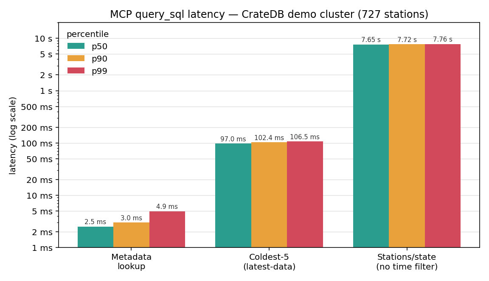

# Query IoT data in CrateDB with an MCP server

CrateDB stores high-volume IoT and time-series sensor data and lets you query it
in real time with SQL. The Model Context Protocol (MCP) takes this a step
further: it connects an AI assistant directly to your cluster, so you can ask
questions in plain English and let the assistant write the SQL.

This guide builds a small MCP server over the [German dataset](https://github.com/crate/cratedb-explore) we used earlier — a stream of
real-time sensor readings of the kind a typical IoT deployment produces. In a
few minutes you will have an assistant that answers questions such as "What was
the coldest place in Germany yesterday?" against live data.

## What you'll do

You'll write a single Python file that runs as an MCP server and exposes one
tool, `query_sql`. The tool sends statements to CrateDB's HTTP `_sql` endpoint
and returns the rows. Any MCP-capable assistant — Claude Code or Claude Desktop,
for example — can then discover the tool and use it to answer your questions.

## Prerequisites

- Python 3.10 or later.
- A CrateDB cluster with the German weather demo data loaded, reachable on its
  HTTP port (`4200` by default).
- An MCP-capable AI assistant, such as Claude Code or Claude Desktop.

## The dataset

The demo data lives in the `demo` schema and models a weather sensor network:

- `climate_data` — the sensor readings. Each row has a `geo_location`
  (a `geo_point`), a `measurement_time`, and a `data` object whose
  `temperature` is stored in Kelvin, alongside pressure and wind.
- `german_regions` — the 16 German federal states, each with a `geo_coords`
  polygon that describes its boundary, plus full-text `economics`,
  `transportation`, and `introduced_species` columns you can search with
  `MATCH` (so the data answers more than weather — e.g. which states make cars).
- `geo_points` — the weather station locations, with the nearest town for each.

## Step 1 — Install the dependencies

Install the MCP Python SDK and an HTTP client:

```bash
pip install "mcp[cli]" httpx
```

## Step 2 — Create the server

Save the following as [`german_weather_mcp.py`](https://github.com/crate/cratedb-explore/blob/main/src_mcp_search/german_weather_mcp.py).
It connects to CrateDB, then defines a single tool that runs SQL against the
`demo` schema.

```python
"""
Minimal MCP server over the CrateDB German-weather demo schema.

Exposes one tool, `query_sql`, that runs SQL against CrateDB's HTTP `_sql`
endpoint under the `demo` schema. Register it with any MCP client (Claude
Code, Claude Desktop, ...) over stdio — see README.md.

The one rule worth encoding: "in Germany" questions must be polygon-filtered
with WITHIN(...), because demo.geo_points holds near-border foreign towns. That
rule is stated in both the tool description and the server `instructions` so the
connecting model applies it.

Connection defaults to a local cluster (crate@localhost:4200) and can be
overridden with --cratedb-url / --cratedb-host / ... flags or the matching
CRATEDB_* environment variables (flags win).
"""

import argparse
import os
from urllib.parse import urlparse

import httpx
from mcp.server.fastmcp import FastMCP

# Fallbacks so the server runs with no arguments.
DEFAULTS = {
    "host": "localhost",
    "port": "4200",
    "user": "crate",
    "password": "a_password",
    "scheme": "http",
}


def parse_args() -> argparse.Namespace:
    """CLI flags. All default to None so environment variables can layer
    underneath them in resolve_endpoint."""
    p = argparse.ArgumentParser(
        description="MCP server over the CrateDB German-weather demo schema.",
    )
    p.add_argument("--cratedb-url", help="Full URL, e.g. http://user:pw@host:4200/")
    p.add_argument("--cratedb-host", help="CrateDB host.")
    p.add_argument("--cratedb-port", help="CrateDB HTTP port (default 4200).")
    p.add_argument("--cratedb-user", help="CrateDB username.")
    p.add_argument("--cratedb-password", help="CrateDB password.")
    p.add_argument("--cratedb-scheme", help="http or https.")
    return p.parse_args()


def resolve_endpoint(args: argparse.Namespace) -> tuple[str, tuple[str, str]]:
    """Resolve the `_sql` endpoint URL and HTTP Basic auth.

    Either a full --cratedb-url / CRATEDB_CLUSTER_URL is supplied, or the
    pieces are assembled from --cratedb-host / CRATEDB_HOST and friends.
    CLI flags always win over environment variables, and anything still
    missing falls back to a local cluster so the example runs out of the box.

    Precedence is, in order: the --cratedb-url flag; any individual
    --cratedb-* flag (which forces the host-parts path so a
    CRATEDB_CLUSTER_URL in the environment can't silently override it);
    CRATEDB_CLUSTER_URL; then host parts from CRATEDB_* env vars / defaults.
    """
    part_flags = (
        args.cratedb_host,
        args.cratedb_port,
        args.cratedb_user,
        args.cratedb_password,
        args.cratedb_scheme,
    )
    url = args.cratedb_url or (
        os.environ.get("CRATEDB_CLUSTER_URL") if not any(part_flags) else None
    )
    if url:
        u = urlparse(url)
        scheme = u.scheme or DEFAULTS["scheme"]
        host = u.hostname or DEFAULTS["host"]
        port = str(u.port or DEFAULTS["port"])
        user = u.username or DEFAULTS["user"]
        password = u.password or DEFAULTS["password"]
    else:
        scheme = args.cratedb_scheme or os.environ.get("CRATEDB_SCHEME") or DEFAULTS["scheme"]
        host = args.cratedb_host or os.environ.get("CRATEDB_HOST") or DEFAULTS["host"]
        port = args.cratedb_port or os.environ.get("CRATEDB_PORT") or DEFAULTS["port"]
        user = args.cratedb_user or os.environ.get("CRATEDB_USER") or DEFAULTS["user"]
        password = args.cratedb_password or os.environ.get("CRATEDB_PASSWORD") or DEFAULTS["password"]
    return f"{scheme}://{host}:{port}/_sql", (user, password)


ENDPOINT, AUTH = resolve_endpoint(parse_args())

INSTRUCTIONS = (
    "Tools query a CrateDB cluster of German weather and regional data in the "
    "`demo` schema: climate_data (geo_location geo_point, measurement_time, "
    "data['temperature'] in Kelvin), german_regions (16 Laender with geo_coords "
    "polygons plus full-text columns economics, transportation and "
    "introduced_species - use MATCH() on these to answer questions about a "
    "region's industry (e.g. car factories), transport or wildlife), geo_points "
    "(station locations). "
    "Temperatures are Kelvin - always show Celsius first, Kelvin in "
    "parentheses, e.g. -8.99 C (264.16 K). "
    "For ANY 'where in Germany' / most-extreme-place question you MUST "
    "restrict candidates with WITHIN(c.geo_location, r.geo_coords) by joining "
    "climate_data c to german_regions r; geo_points alone leaks near-border "
    "foreign towns (e.g. Tannheim in Tyrol). "
    "When a query touches geo_points and the user gives no time range, limit it "
    "to the latest data with measurement_time = (SELECT MAX(d2.measurement_time) "
    "FROM demo.climate_data d2)."
)

mcp = FastMCP("german-weather", instructions=INSTRUCTIONS)


@mcp.tool()
def query_sql(statement: str) -> str:
    """Run a read-only SQL statement against the CrateDB `demo` schema and
    return columns + rows.

    Beyond weather readings, german_regions carries full-text economics,
    transportation and introduced_species columns - answer questions about a
    region's industry (e.g. car factories), transport or wildlife with
    MATCH(<column>, '<terms>') rather than assuming the data is weather-only.

    "In Germany" / most-extreme-place questions MUST polygon-filter candidates
    with WITHIN(c.geo_location, r.geo_coords), joining demo.climate_data c to
    demo.german_regions r - do NOT use geo_points or DISTANCE() alone as the
    country filter (geo_points contains near-border foreign towns). Temperatures
    are Kelvin: report Celsius first with Kelvin in parentheses.

    When a query touches geo_points and the user gives no time range, limit it
    to the latest data with
    measurement_time = (SELECT MAX(d2.measurement_time) FROM demo.climate_data d2).
    """
    # CrateDB's HTTP _sql endpoint is stateless, so the persistent equivalent
    # of `SET search_path TO demo` is the Default-Schema header on each request.
    r = httpx.post(
        ENDPOINT,
        json={"stmt": statement},
        auth=AUTH,
        headers={"Default-Schema": "demo"},
        timeout=60,
    )
    r.raise_for_status()
    data = r.json()
    cols, rows = data.get("cols", []), data.get("rows", [])
    lines = [f"columns: {cols}", f"row count: {len(rows)}"]
    lines += [f"  {row}" for row in rows[:50]]
    if len(rows) > 50:
        lines.append(f"  ... {len(rows) - 50} more rows omitted")
    return "\n".join(lines)


if __name__ == "__main__":
    mcp.run()
```

A few details make this work against CrateDB:

- The connection is resolved once at startup by `resolve_endpoint`, which reads
  the `--cratedb-*` flags, then the matching `CRATEDB_*` environment variables,
  and falls back to a local `crate@localhost:4200` cluster — so the example runs
  out of the box and still points at a remote cluster when you pass flags.
- The server posts to the HTTP `_sql` endpoint on port `4200` and reads the
  `cols` and `rows` from the JSON response.
- Each request carries a `Default-Schema: demo` header. The `_sql` endpoint is
  stateless, so this header is the durable equivalent of `SET search_path TO
  demo` and lets the assistant use unqualified table names.
- The `instructions` and the tool description carry the data rules — Kelvin
  display, the geographic filter, and a default to the latest data — so the
  assistant applies them without being reminded in every prompt.

When a question about station locations gives no time range, the assistant
scopes the query to the most recent readings rather than the whole history:

```sql
WHERE measurement_time = (SELECT MAX(d2.measurement_time) FROM demo.climate_data d2)
```

## Step 3 — Register the server

### Point the server at your cluster

The server has to be told where CrateDB is. It reads the connection from
`--cratedb-*` flags (or the matching `CRATEDB_*` environment variables) and only
falls back to `crate@localhost:4200` if you pass nothing — so unless you happen
to be running CrateDB locally with the default user, **you must supply
connection parameters**. The simplest is a single URL:

```bash
--cratedb-url "https://<user>:<password>@<host>:4200/"
```

or set the equivalent pieces as environment variables before launching:

```bash
export CRATEDB_HOST=<host>
export CRATEDB_USER=<user>
export CRATEDB_PASSWORD=<password>
export CRATEDB_SCHEME=https        # http for a plain local cluster
```

Every command below shows the URL flag; drop it only if your cluster really is
the local default.

### Smoke-test the script

First run the script on its own, so you register something that runs. An MCP
client normally launches the server for you over stdio, but running it by hand
confirms `python` can import `mcp`/`httpx` and find the file:

```bash
python /path/to/german_weather_mcp.py --cratedb-url "https://<user>:<password>@<host>:4200/"
```

It should start and then wait silently for input on stdin (it's a stdio server
with no banner) — that means it launched cleanly; press Ctrl+C to stop it. If it
exits with a traceback instead, fix that before going on: the usual causes are a
wrong path to `german_weather_mcp.py` or a `python` that can't see the installed
`mcp`/`httpx` packages. The CrateDB connection itself isn't tested here — bad
host or credentials only surface on the first query, in Step 4.

### Register with your assistant

For Claude Code, add the server from the command line — everything after `--` is
the launch command, so the connection flag goes there too:

```bash
claude mcp add german-weather -- python /path/to/german_weather_mcp.py --cratedb-url "https://<user>:<password>@<host>:4200/"
```

For Claude Desktop, add an entry to `claude_desktop_config.json`, passing the
connection flag as its own argument (or set the `CRATEDB_*` vars in an `env`
block instead):

```json
{
  "mcpServers": {
    "german-weather": {
      "command": "python",
      "args": [
        "/path/to/german_weather_mcp.py",
        "--cratedb-url",
        "https://<user>:<password>@<host>:4200/"
      ]
    }
  }
}
```

Restart the assistant so it picks up the new server.

Then confirm it connected before moving on. In Claude Code, run `claude mcp list`
(or `/mcp` from inside a session) and check that `german-weather` shows as
connected with the `query_sql` tool available; in Claude Desktop, the tool
appears under the tools (hammer) icon. If it doesn't show up after the script
ran cleanly on its own above, the registration path or restart is the thing to
recheck.

## Step 4 — Ask a question

With the server registered, ask a question in natural language:

> What is the single lowest temperature reading anywhere inside Germany?

The assistant writes and runs the SQL through `query_sql`, then answers with the
temperature in Celsius first and Kelvin in parentheses. Run against the demo
cluster, it returns:

> The single lowest temperature reading anywhere inside Germany is
> **-10.41 C (262.74 K)**, at `[12.75, 50.5]` in the Vogtland area of Saxony,
> near the Czech border.

## Filtering by geography

One rule is worth calling out, because it is easy to get wrong. The
`geo_points` table includes a handful of towns just across the border — for
instance, Tannheim in Tyrol. A query that uses `geo_points` or `DISTANCE()`
alone to decide what counts as "in Germany" will quietly include them and report
the wrong answer.

The correct approach is a polygon join: keep only the readings whose location
falls inside a German state boundary.

```sql
SELECT g.nearest_town, c.data['temperature'] AS kelvin
FROM demo.climate_data c
JOIN demo.german_regions r ON WITHIN(c.geo_location, r.geo_coords)
JOIN demo.geo_points g ON g.geo_location = c.geo_location
WHERE c.measurement_time = (SELECT MAX(d2.measurement_time) FROM demo.climate_data d2)
ORDER BY kelvin ASC
LIMIT 1;
```

Because the rule lives in the server's instructions, the assistant adds the
`WITHIN` join on its own whenever a question is scoped to Germany. The
lowest-temperature question above shows it working: the three coldest values in
the raw data — down to 261.08 K (-12.07 C) — all sit at `[10.5, 47.5]`, which is
Tannheim in Tyrol, just outside the German polygons. The polygon join excludes
them, so the lowest reading that is genuinely inside Germany is the -10.41 C
(262.74 K) value reported above.

## Performance

The latest-data default is not only about correctness; it keeps geospatial
questions fast. Measured against the demo cluster — a network of 727 stations —
over the HTTP `_sql` endpoint, the round-trip latencies are:



| Query | p50 | p90 | p99 |
| --- | --- | --- | --- |
| Region metadata lookup | 2.5 ms | 3.0 ms | 4.9 ms |
| Coldest stations, scoped to the latest reading | 97 ms | 102 ms | 107 ms |
| Stations per state, no time filter | 7.65 s | 7.72 s | 7.76 s |

The point-in-polygon `WITHIN` join is the expensive part of any "in Germany"
query. Scoping `climate_data` to the latest snapshot before that join, as the
server's instructions ask, keeps the coldest-stations question near 100 ms —
roughly 80 times faster than the unscoped polygon scan in the bottom row.

## Next steps

- Read the [CrateDB MCP documentation](https://cratedb.com/docs/guide/integrate/mcp/cratedb-mcp.html)
  for the full picture, including documentation retrieval.
- Explore [`cratedb-mcp`](https://github.com/crate/cratedb-mcp), the
  ready-to-run MCP server from Crate.io, for production use.
