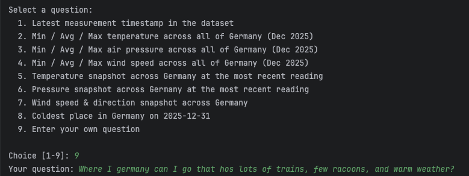

# GermanWeather (.NET) — ask Claude questions about a CrateDB weather cluster



.NET port of [`src_mcp_search/main/java/`](../java/README.md). Same canned
questions, same Grafana-panel-as-tool mechanism, same SQL. Talks to the
Anthropic Messages API over plain HTTP (no third-party SDK), matching the
existing project style.

---

## What this program does

We give Claude two ways to query a CrateDB cluster:

1. **`query_sql`** — a single user-defined tool that POSTs arbitrary
   SQL to CrateDB's HTTP `_sql` endpoint. Replaces the `cratedb-mcp`
   subprocess used in the Python version.
2. **One tool per Grafana panel**, generated at startup from
   `../../../grafana/german_weather_data.json`. Tool names come from
   the panel titles; parameters come from the Grafana template
   variables (`$region`, `$keyword`, `$latitude`, `$longitude`,
   `$__timeFilter`).

The user picks one of 8 canned questions or types their own, and the
agent loop runs to completion, printing tool calls and intermediate
text as they arrive.

### Why no MCP / no SDK here

The Python `claude-agent-sdk` bundles an MCP client. The .NET port
skips both MCP and any Anthropic SDK and calls the Messages API
directly via `HttpClient`. The wire format is small enough that this
keeps the dependency surface zero — same approach `CrateDbClient`
takes for the CrateDB endpoint.

---

## Files

| File | Purpose |
|---|---|
| `Program.cs` | Entry point. CLI parsing, menu, manual tool-use agent loop. |
| `PanelTools.cs` | Loads the Grafana JSON and builds one tool per panel. |
| `CrateDbClient.cs` | Thin HTTP client for CrateDB's `_sql` endpoint. |
| `GermanWeather.csproj` | .NET project file (targets net10.0). |

---

## Prerequisites

- .NET 10 SDK (or adjust `<TargetFramework>` to `net8.0` if needed)
- A reachable CrateDB cluster on port 4200
- An Anthropic API key

---

## Configuration

Same precedence as the Python/Java versions (flag > env var).
Credentials are required up front — anonymous CrateDB access would 401
on every tool call.

| Flag | Env var | Required? | Default |
|---|---|---|---|
| `--cratedb-url` | `CRATEDB_CLUSTER_URL` | one of url / host (must embed user:password) | — |
| `--cratedb-host` | `CRATEDB_HOST` | one of url / host | — |
| `--cratedb-port` | `CRATEDB_PORT` | no | `4200` |
| `--cratedb-user` | `CRATEDB_USER` | yes (when using --cratedb-host) | — |
| `--cratedb-password` | `CRATEDB_PASSWORD` | yes (when using --cratedb-host) | — |
| `--cratedb-scheme` | `CRATEDB_SCHEME` | no | `http` |
| `--anthropic-api-key` | `ANTHROPIC_API_KEY` | yes | — |

---

## Running

```bash
cd src_mcp_search/main/dotnet

export ANTHROPIC_API_KEY=sk-ant-...
dotnet run -- \
    --cratedb-host 10.13.1.19 \
    --cratedb-user scott \
    --cratedb-password tiger
```

You'll see the panel tools registered, then the menu:

```
[panels] registered 15 panel tool(s):
          - keyword_relevance_to_search_categories
          - search_categories_and_region
          - last_measurement_time
          ...

Select a question:
  1. Latest measurement timestamp in the dataset
  2. Min / Avg / Max temperature across all of Germany (Dec 2025)
  ...
  8. Coldest place in Germany on 2025-12-31
  9. Enter your own question

Choice [1-9]:
```

Pick a number. For option 9 you'll be prompted again for the question
text.

Each tool call shows up on stdout as

```
[tool] last_measurement_time({"time_from":"2025-12-01","time_to":"2025-12-31"})
```

and the final answer is printed before `=== done ===`.

---

## How the agent loop works

Implemented manually in `Program.RunAgentAsync`:

1. Build a request body with `model`, `max_tokens`, `system`, `tools`,
   and `messages` (one initial user turn).
2. POST to `https://api.anthropic.com/v1/messages`.
3. Walk the response `content[]`:
   - `{"type": "text"}` → print, and remember as an assistant turn block.
   - `{"type": "tool_use"}` → print a `[tool] ...` trace, dispatch to
     the local handler, remember the call as an assistant turn block.
4. If there were any tool uses, append the assistant turn plus a
   follow-up user turn carrying one `tool_result` block per call.
   Then loop.
5. Stop when a response has no tool uses, or when we hit
   `MaxTurns = 30`.

Tools are advertised to the API via the `tools` field on the request
(separate from the system prompt). The system prompt only steers
*behaviour* — preferring panel tools over `query_sql`, converting
Kelvin to Celsius, probing before declining, etc.

---

## How Grafana panels become tools

`PanelTools.LoadFromFileAsync` does the same three-step pipeline as
the Java and Python versions:

### 1. Parse the dashboard JSON

```jsonc
{
  "panels": [
    {
      "id": 9,
      "type": "timeseries",
      "title": "Min, Average and Max temperature for $region",
      "targets": [
        { "refId": "A",
          "rawSql": "SELECT ... WHERE $__timeFilter(\"measurement_time\") ..." }
      ]
    },
    { "type": "row", "title": "Change over time" }
  ]
}
```

Rows are section headers and are skipped. Everything else with a
`rawSql` target becomes a tool.

### 2. Discover what arguments each panel needs

Regex over the SQL finds `$var` / `${var}` references and the
`$__timeFilter()` macro. Each known variable in `VarSpec` becomes a
parameter on the resulting tool; `$__timeFilter` adds `time_from` /
`time_to`.

### 3. Register the tool

Tool name is `Slugify(panel.title)`. The handler captures the SQL
template; on invocation it substitutes the call arguments
(`RenderSql`), POSTs the rendered SQL via `CrateDbClient.RunSqlAsync`,
and formats the result.

---

## Default schema

Every CrateDB HTTP request from `CrateDbClient` carries
`Default-Schema: demo`, so unqualified table names resolve under the
`demo` schema. This is the persistent equivalent of `SET search_path
TO demo` (CrateDB's `_sql` endpoint is stateless, so a literal SET
wouldn't carry across requests).
