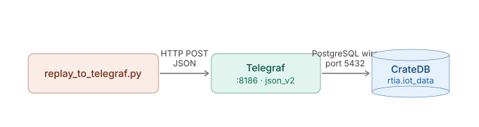

# Telegraf Integration

In this section, you'll see how to stream live IoT data into CrateDB using Telegraf, InfluxData's open-source metrics agent.

Because CrateDB is PostgreSQL wire protocol compatible, Telegraf writes to it directly with its native `outputs.cratedb` plugin (port 5432). One thing to know: CrateDB has **no** InfluxDB line-protocol endpoint, so `outputs.cratedb` is the supported path — migrating an existing Telegraf setup is simply swapping `outputs.influxdb` → `outputs.cratedb`.

Building on the RTIA industrial dataset, this example replays sensor readings to a Telegraf HTTP listener, which writes them to the **same** `rtia.iot_data` table as the bulk `COPY FROM` load. Geo still works: `geo_location` is a `GEO_POINT` generated server-side from the `geo_lon` / `geo_lat` fields.

- Start Telegraf with the provided `telegraf_demo.conf` (HTTP listener + `outputs.cratedb`).
- Run a Python script that replays the dataset into Telegraf.
- Query `rtia.iot_data` in CrateDB — including geo `DISTANCE()` queries — to see the streamed rows.
