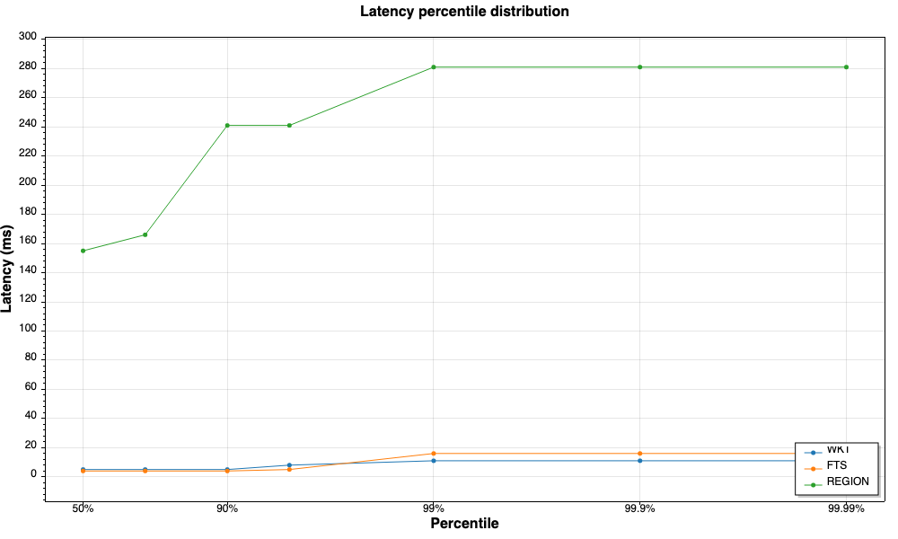

# QueryCrate — .NET

C# / .NET port of the CrateDB climate data load-generator. Connects to a [CrateDB](https://crate.io/) cluster over the PostgreSQL wire protocol using [Npgsql](https://www.npgsql.org/) and runs a configurable mix of queries against German climate and region data.

## What it does

1. Opens an Npgsql connection to a CrateDB cluster.
2. Prints the cluster name (`SELECT name FROM sys.cluster`) as a connectivity smoke test.
3. Pre-loads reference data from the database (only for query types that will be run):
   - **WKT** queries: loads every distinct `geo_location` and `measurement_time` from `demo.climate_data`.
   - **REGION** queries: loads every `region_name` from `demo.german_regions`.
   - **FTS** queries: uses canned search terms (*cars*, *trains*, *factories*, *energy*) rotated randomly — no data is pre-loaded from the database.
4. Runs a workload of queries at a configurable rate, choosing from three query types:

   **WKT** — geo-proximity query: finds min/max temperature within 1 metre of a random point at a random timestamp.
   ```sql
   SELECT min(data['temperature']) min_t, max(data['temperature']) max_t
   FROM demo.climate_data
   WHERE distance(geo_location, $1::geo_point) < 1
     AND measurement_time = $2
   ```

   **REGION** — three-table join: finds the latest temperature readings for every sensor location inside a named German region, converting Kelvin to Celsius.
   ```sql
   SELECT d.measurement_time as time,
          latitude(d.geo_location) as latitude,
          longitude(d.geo_location) as longitude,
          data['temperature'] - 273.15 as temperature,
          gp.nearest_town
   FROM demo.climate_data d, demo.german_regions r, demo.geo_points gp
   WHERE WITHIN(d.geo_location, r.geo_coords)
     AND gp.geo_location = d.geo_location
     AND r.region_name = $1
     AND d.measurement_time = (SELECT max(d2.measurement_time) FROM demo.climate_data d2)
   ```

   **FTS** — full-text search: searches the `economics` column of `demo.german_regions` using CrateDB's `MATCH` predicate and returns the top 3 results by relevance score.
   ```sql
   SELECT region_name, _score
   FROM demo.german_regions
   WHERE MATCH(economics, $1)
   ORDER BY _score DESC
   LIMIT 3
   ```

5. Records the round-trip latency of each query in an [HdrHistogram](https://github.com/HdrHistogram/HdrHistogram) and prints percentile summaries when the run finishes.

## Prerequisites

- .NET 10.0 SDK (or later)
- Network access to your CrateDB cluster on port 5432
- The following tables populated in a `demo` schema:
  - `climate_data` — with `geo_location` (`geo_point`), `measurement_time` (`timestamp`), and `data` (`object` with a `temperature` field)
  - `german_regions` — with `region_name`, `geo_coords` (polygon), and `economics` (full-text indexed)
  - `geo_points` — with `geo_location` and `nearest_town`

## Setup

```bash
dotnet restore
```

## Usage

The application takes four mandatory positional arguments and optional `TYPE:COUNT` pairs to define the query mix. Database credentials are read from the `CRATE_USER` and `CRATE_PASSWORD` environment variables so they never land in shell history or process listings.

```bash
CRATE_USER=<user> CRATE_PASSWORD=<password> \
dotnet run -- <duration-seconds> <host> <requests-per-second> <sslmode> [TYPE:COUNT ...]
```

| Argument              | Description                                                                                |
| --------------------- | ------------------------------------------------------------------------------------------ |
| `duration-seconds`    | How long the polling loop should run.                                                      |
| `host`                | CrateDB hostname (port `5432` and database `crate` are hard-coded).                        |
| `requests-per-second` | Target throughput. The loop paces itself so each iteration takes about `1000 / rps` ms. If the database can't keep up the loop just runs as fast as it can. |
| `sslmode`             | PostgreSQL SSL mode for the Npgsql connection. Common values: `disable`, `prefer`, `require`. Use `require` for CrateDB Cloud and `disable` for a plain local cluster. |
| `TYPE:COUNT`          | Optional. One or more query-type specifications. Supported types: `WKT`, `REGION`, `FTS`. If omitted, runs WKT queries continuously for the full duration. When multiple types are specified, their queries are shuffled into a random order. |

### Examples

Run WKT queries continuously for 120 seconds against CrateDB Cloud at ~50 req/sec:

```bash
CRATE_USER=admin CRATE_PASSWORD=secret \
dotnet run -- 120 my-cluster.eks1.eu-west-1.aws.cratedb.net 50 require
```

Run a mixed workload (100 WKT + 50 REGION + 30 FTS queries) against a local cluster:

```bash
CRATE_USER=admin CRATE_PASSWORD=secret \
dotnet run -- 120 localhost 50 disable WKT:100 REGION:50 FTS:30
```

The Npgsql connection string is built as:

```
Host=<host>;Port=5432;Database=crate;Username=<user>;Password=<password>;SSL Mode=<sslmode>
```

## Sample output

```
my-cluster
Loaded 726 geo points.
Loaded 365 timestamps.
POINT(12.25 48.25) @ 14/07/2025 00:00:00 -> min=292.68 max=292.68
region=Bayern time=31/12/2025 00:00:00 lat=48.25 lon=11.75 temp=2.3 town=Munich
FTS 'cars' -> region=Thüringen score=0.9552864
...
WKT: count=100 avg=5.5ms p50=5ms p99=7ms p99.9=7ms max=8ms
REGION: count=50 avg=103.0ms p50=110ms p99=165ms p99.9=165ms max=170ms
FTS: count=30 avg=6.0ms p50=6ms p99=7ms p99.9=7ms max=8ms
Wrote chart: /path/to/latency_histogram.png
```

## Latency chart

After the textual summary the program writes `latency_histogram.png` in
the working directory — a percentile-distribution plot rendered with
[ScottPlot](https://scottplot.net/), one line per query type.



ScottPlot 5.x has no built-in log-axis transform, so the X values are
log10-transformed before plotting and the ticks are placed manually via
a `NumericManual` generator with labels `50%`, `90%`, `99%`, `99.9%`,
`99.99%`. Log-spacing means the long tail (p99 → p99.99) gets visible
separation instead of being crushed against the right edge. Y is
round-trip latency in milliseconds. In the chart above the REGION line
climbs from ~155ms at p50 to a ~280ms plateau by p99, while WKT and FTS
hug the floor at single-digit milliseconds.

## Notes on the SQL

- **`distance(geo_location, $1::geo_point) < 1`** — CrateDB stores `geo_point` values in a Lucene-encoded form that quantises the underlying doubles, so an exact `=` comparison against a value you read back will not always match. Filtering with a 1-metre tolerance reliably identifies the same grid square at climate-data resolution.
- **`$1::geo_point`** — the `$1` is an Npgsql positional parameter placeholder; `::geo_point` is PostgreSQL/CrateDB cast syntax. The parameter is bound as a WKT string (`POINT(lon lat)`) and the server parses it.
- **`measurement_time`** — the timestamp column in `demo.climate_data`.
- **`WITHIN(d.geo_location, r.geo_coords)`** — CrateDB geo function that tests whether a point falls inside a polygon. Used in the REGION query to find all sensors within a named German state.
- **`MATCH(economics, $1)`** — CrateDB's full-text search predicate. The `economics` column has a full-text index, and `MATCH` scores each row by relevance. `_score` is a built-in CrateDB relevance column.

## License

Apache License 2.0. See the [LICENSE](../../../LICENSE) file.
