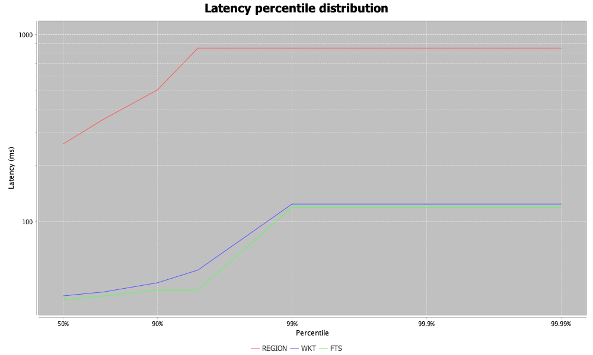

# crate-germanweather-javaexample

A Java/JDBC load generator that connects to a [CrateDB](https://crate.io/) cluster over the PostgreSQL wire protocol and runs a configurable mix of queries against German climate and region data.

The single application class is [`QueryCrate`](QueryCrate.java).

## What it does

1. Opens a JDBC connection to a CrateDB cluster.
2. Prints the cluster name (`SELECT name FROM sys.cluster`) as a connectivity smoke test.
3. Pre-loads reference data from the database (only for query types that will be run):
   - **WKT** queries: loads every distinct `geo_location` and `timestamp` from `demo.climate_data`.
   - **REGION** queries: loads every `region_name` from `demo.german_regions`.
   - **FTS** queries: uses canned search terms (*cars*, *trains*, *factories*, *energy*) rotated randomly — no data is pre-loaded from the database.
4. Runs a workload of queries at a configurable rate, choosing from three query types:

   **WKT** — geo-proximity query: finds min/max temperature within 1 metre of a random point at a random timestamp.
   ```sql
   SELECT min(data['temperature']) min_t, max(data['temperature']) max_t
   FROM demo.climate_data
   WHERE distance(geo_location, ?::geo_point) < 1
     AND measurement_time = ?
   ```

   **REGION** — three-table join: finds the latest temperature readings for every sensor location inside a named German region, converting Kelvin to Celsius.
   ```sql
   SELECT d.measurement_time as time,
          latitude(d.geo_location) as latitude,
          longitude(d.geo_location) as longitude,
          data['temperature'] - 273.15 as temperature,
          gp.nearest_town
   FROM demo.climate_data d, demo.german_regions r, demo.geo_points gp
   WHERE WITHIN(d.geo_location, r.geo_coords)
     AND gp.geo_location = d.geo_location
     AND r.region_name = ?
     AND d.measurement_time = (SELECT max(d2.measurement_time) FROM demo.climate_data d2)
   ```

   **FTS** — full-text search: searches the `economics` column of `demo.german_regions` using CrateDB's `MATCH` predicate and returns the top 3 results by relevance score.
   ```sql
   SELECT region_name, _score
   FROM demo.german_regions
   WHERE MATCH(economics, ?)
   ORDER BY _score DESC
   LIMIT 3
   ```

5. Records the round-trip latency of each query in an [HdrHistogram](https://github.com/HdrHistogram/HdrHistogram) and prints percentile summaries when the run finishes.

## Prerequisites

- Java 17+
- Maven 3.9+
- Network access to your CrateDB cluster on port 5432
- The following tables populated in a `demo` schema:
  - `climate_data` — with `geo_location` (`geo_point`), `measurement_time` (`timestamp`), and `data` (`object` with a `temperature` field)
  - `german_regions` — with `region_name`, `geo_coords` (polygon), and `economics` (full-text indexed)
  - `geo_points` — with `geo_location` and `nearest_town`

## Build

```bash
mvn clean package
```

## Run

The application takes four mandatory positional arguments and optional `TYPE:COUNT` pairs to define the query mix. Database credentials are read from the `CRATE_USER` and `CRATE_PASSWORD` environment variables so they never land in shell history or process listings.

```bash
export CRATE_USER='admin'
export CRATE_PASSWORD='your-password'
mvn compile exec:java -Dexec.args="<duration-seconds> <host> <requests-per-second> <sslmode> [TYPE:COUNT ...]"
```

| Argument              | Description                                                                                |
| --------------------- | ------------------------------------------------------------------------------------------ |
| `duration-seconds`    | How long the polling loop should run.                                                      |
| `host`                | CrateDB hostname (port `5432` and database `crate` are hard-coded).                        |
| `requests-per-second` | Target throughput. The loop paces itself so each iteration takes about `1000 / rps` ms. If the database can't keep up the loop just runs as fast as it can. |
| `sslmode`             | PostgreSQL SSL mode for the JDBC connection. Common values: `disable`, `require`, `verify-ca`, `verify-full`. Use `require` for CrateDB Cloud and `disable` for a plain local cluster. |
| `TYPE:COUNT`          | Optional. One or more query-type specifications. Supported types: `WKT`, `REGION`, `FTS` — see [Query types](#query-types) below. If omitted, runs WKT queries continuously for the full duration. When multiple types are specified, their queries are shuffled into a random order. |

### Query types

Behavioural detail behind the three TYPE codes — what each call samples, which side of CrateDB it stresses, and where the resulting line tends to sit on the latency chart. The SQL itself is in [What it does](#what-it-does) above; this is the operational sketch.

#### `WKT` — geo-proximity scan

- Picks a random `geo_point` from the pre-loaded location pool and a random `timestamp` from the pre-loaded time pool.
- Issues `SELECT min/max(data['temperature']) … WHERE distance(geo_location, '<wkt>'::geo_point) < 1 AND measurement_time = ?` — one row out per call (min and max of a single grid cell at a single moment).
- Exercises CrateDB's spatial filtering on `geo_point`. Typically the cheapest of the three — single point, single timestamp, no joins — so the WKT line sits at the low end of the chart.
- Requires the `geo_points` and `timestamps` pools (`loadGeoPoints` / `loadTimestamps` at startup).

#### `REGION` — three-table join, latest snapshot

- Picks a random federal-state name from the `german_regions` table.
- Issues a three-way join across `climate_data`, `german_regions`, `geo_points`, filtered to the most recent `measurement_time` via a correlated subquery, returning every sensor inside the region's polygon with its nearest-town label and a Kelvin → Celsius conversion.
- Exercises `WITHIN(point, polygon)` containment, the correlated subquery, and an inner join on `geo_location`. Returns dozens of rows per call (one per sensor in the region).
- Almost always the slowest query type — the REGION line sits at the top of the chart. Three things stack up:
  1. **Polygon containment is expensive.** `WITHIN(point, polygon)` tests every candidate `geo_point` against the region's boundary — roughly O(polygon vertices) per candidate, versus the WKT query's single point-to-point distance check.
  2. **Cluster-wide aggregation per call.** The correlated `(SELECT max(d2.measurement_time) FROM climate_data d2)` subquery has to look at the whole climate-data table to find the latest epoch, every time the query runs.
  3. **Bigger result set.** Returns dozens of rows (one per sensor in the region), versus WKT's one min/max row and FTS's three — more bytes ship back per call and more deserialization on the client.
- Requires the `region_names` pool.

#### `FTS` — full-text relevance ranking

- Picks a random search term from a fixed set (`cars`, `trains`, `factories`, `energy`).
- Issues `SELECT region_name, _score FROM german_regions WHERE MATCH(economics, ?) ORDER BY _score DESC LIMIT 3`.
- Exercises the full-text index on the `economics` column and CrateDB's `MATCH` predicate. `_score` is computed by the Lucene-based search engine and exposed as a built-in column. Always 3 rows out.
- Fast in steady state — typically clusters with WKT at the bottom of the chart, with occasional tail spikes on cold matches.
- No pre-loaded pool needed; the search terms are inline.

### Examples

Run WKT queries continuously for 120 seconds against CrateDB Cloud at ~50 req/sec:

```bash
export CRATE_USER='admin'
export CRATE_PASSWORD='your-password'
mvn compile exec:java -Dexec.args="120 my-cluster.eks1.eu-west-1.aws.cratedb.net 50 require"
```

Run a mixed workload (100 WKT + 50 REGION + 30 FTS queries) against a local cluster:

```bash
export CRATE_USER='admin'
export CRATE_PASSWORD='your-password'
mvn compile exec:java -Dexec.args="120 localhost 50 disable WKT:100 REGION:50 FTS:30"
```

The JDBC URL is built as:

```
jdbc:postgresql://<host>:5432/crate?sslmode=<sslmode>
```

## Sample output

```
my-cluster
Loaded 727 geo points.
Loaded 8760 timestamps.
POINT(13.74999993480742 52.49999997206032) @ 2024-06-15 12:00:00.0 -> min=21.4 max=21.4
POINT(8.999999966472387 54.24999999348074) @ 2024-02-03 03:00:00.0 -> min=-1.2 max=-1.2
region=Bayern time=2024-12-31 23:00:00.0 lat=48.25 lon=11.75 temp=2.3 town=Munich
FTS 'cars' -> region=Baden-Wurttemberg score=4.23
...
WKT: count=100 avg=12.3ms p50=11ms p99=34ms p99.9=34ms max=45ms
REGION: count=50 avg=85.2ms p50=78ms p99=190ms p99.9=190ms max=210ms
FTS: count=30 avg=5.1ms p50=4ms p99=15ms p99.9=15ms max=18ms
Wrote chart: /path/to/latency_histogram.png
```

## Latency chart

After the textual summary the program writes `latency_histogram.png` in
the working directory — a percentile-distribution plot rendered with
[JFreeChart](https://www.jfree.org/jfreechart/), one line per query
type.



The X axis is `log10(1/(1-p/100))`, relabeled directly as `50%`, `90%`,
`99%`, `99.9%`, `99.99%`. Log-spacing means the long tail
(p99 → p99.99) gets visible separation instead of being crushed against
the right edge. Y is round-trip latency in milliseconds, also on a
`LogarithmicAxis` so a fast query at ~10ms and a slow one at ~1000ms
both have visible vertical space (a linear Y would crush the fast
queries into the floor). Values are clamped to a 1ms minimum so the log
axis doesn't blow up on sub-millisecond samples. In the chart above the
REGION line climbs from ~260ms at p50 to ~850ms by p99, while WKT and
FTS sit lower at ~30–125ms.

## Notes on the SQL

- **`distance(geo_location, ?::geo_point) < 1`** — CrateDB stores `geo_point` values in a Lucene-encoded form that quantises the underlying doubles, so an exact `=` comparison against a value you read back will not always match. Filtering with a 1-metre tolerance reliably identifies the same grid square at climate-data resolution.
- **`?::geo_point`** — the `?` is a JDBC parameter placeholder; `::geo_point` is PostgreSQL/CrateDB cast syntax. The parameter is bound as a WKT string (`POINT(lon lat)`) and the server parses it.
- **`measurement_time`** — the timestamp column in `demo.climate_data`.
- **`WITHIN(d.geo_location, r.geo_coords)`** — CrateDB geo function that tests whether a point falls inside a polygon. Used in the REGION query to find all sensors within a named German state.
- **`MATCH(economics, ?)`** — CrateDB's full-text search predicate. The `economics` column has a full-text index, and `MATCH` scores each row by relevance. `_score` is a built-in CrateDB relevance column.

## Project layout

```
src/main/java/
└── QueryCrate.java     # the application
```

## License

Apache License 2.0. See the [LICENSE](../../../LICENSE) file.
